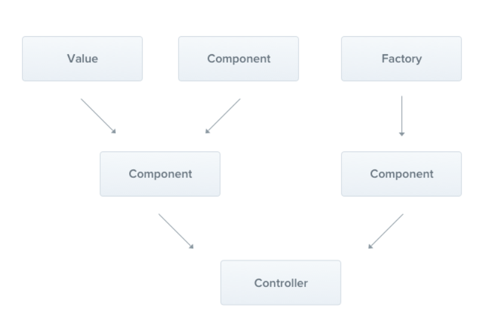
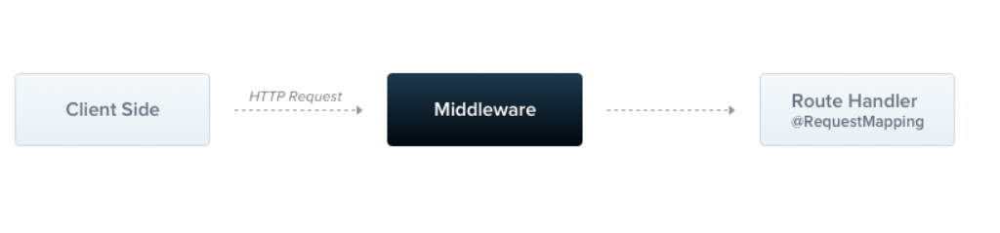

<p align="center">
  <a href="http://nestjs.com/" target="blank"></a>
</p>

[circleci-image]: https://img.shields.io/circleci/build/github/nestjs/nest/master?token=abc123def456
[circleci-url]: https://circleci.com/gh/nestjs/nest

  <p align="center">A progressive <a href="http://nodejs.org" target="_blank">Node.js</a> framework for building efficient and scalable server-side applications.</p>
    <p align="center">
<a href="https://www.npmjs.com/~nestjscore" target="_blank"></a>
<a href="https://www.npmjs.com/~nestjscore" target="_blank"></a>
<a href="https://www.npmjs.com/~nestjscore" target="_blank"></a>
<a href="https://circleci.com/gh/nestjs/nest" target="_blank"></a>
<a href="https://coveralls.io/github/nestjs/nest?branch=master" target="_blank"></a>
<a href="https://discord.gg/G7Qnnhy" target="_blank"></a>
<a href="https://opencollective.com/nest#backer" target="_blank"></a>
<a href="https://opencollective.com/nest#sponsor" target="_blank"></a>
  <a href="https://paypal.me/kamilmysliwiec" target="_blank"></a>
    <a href="https://opencollective.com/nest#sponsor"  target="_blank"></a>
  <a href="https://twitter.com/nestframework" target="_blank"></a>
</p>
  <!--[](https://opencollective.com/nest#backer)
  [](https://opencollective.com/nest#sponsor)-->

## Description
The first project covers the basics of using [Nest](https://github.com/nestjs/nest) framework, providing explanations of how each component functions and its responsibilities. Subsequent projects will build upon this foundation by adding additional content and concepts related to this framework.

## Prerequisites

 [Node.js](https://nodejs.org/en) (version >= 16) is installed and Package Manager on your operating system.  Which package manager would you 🙄 to use? npm


## First steps

```bash
$ npm i -g @nestjs/cli
$ nest new project-name
```

## Project created 

```bash

📁src/
  🌟  app.controller.spec.ts -  Unit tests   
  🌟  app.controller.ts - Controller with a single route
  🌟  app.module.ts - The root module
  🌟  app.service.ts - Service with a single method
  ☠️  main.ts - Core function - (express/fastify)
```

## Running the app

```bash
# development
$ npm run start

# watch mode
$ npm run start:dev

# production mode
$ npm run start:prod
```

## Test

```bash
# unit tests
$ npm run test

# e2e tests
$ npm run test:e2e

# test coverage
$ npm run test:cov
```
## Notes
### Lifecycle Events


```bash
#initializing
🐱‍🏍 Bootstrappong starts
# Resolves host module dependencies(Controllers, Providers ..)

🐱‍🏍 onModuleInit 
# Called once the host module's dependencies have been resolved

🐱‍🏍 onApplicationBootstrap
#Called once all modules have been initialized, but before listening for connections.

#running

🎮 Start listeners
# HTTP server, WS server

🎮 Appication is running

#terminating N\a

```

<details>
<summary><b style="font-size: 1.25em;">Controllers</b></summary>

Responsible for handling incoming requests and returning responses to the client.
<p align="center" width="100%">
  
</p>

</details>

<details>
<summary><b style="font-size: 1.25em;">Providers</b></summary>

The main idea of a provider is that it can be injected as a dependency.
<p align="center" width="100%">
  
</p>

</details>

<details>
<summary><b style="font-size: 1.25em;">Modules</b></summary>

Nest makes use of to organize the application structure.
<p align="center" width="100%">
  
</p>

</details>

<details>
<summary><b style="font-size: 1.25em;">Middleware</b></summary>

Function which is called before the route handler.
<p align="center" width="100%">
  
</p>

</details>

<details>
<summary><b style="font-size: 1.25em;">Filters/Pipes</b></summary>


<p align="center" width="100%">
  
</p>

</details>

<details>
<summary><b style="font-size: 1.25em;">Guards</b></summary>


Guards have a single responsibility. They determine whether a given request will be handled by the route handler or not,depending on certain conditions

<p align="center" width="100%">
  
</p>

</details>

<details>
<summary><b style="font-size: 1.25em;">Interceptors</b></summary>

<p align="center" width="100%">
  
</p>

</details>

<details>
<summary><b style="font-size: 1.25em;">The details Lifecycle</b></summary>

<p align="center" width="100%">
  
</p>

<p align="center" width="100%">
  
</p>

</details>


### Evolution
 - Branch feature/controller

### Support

Nest is an MIT-licensed open source project. It can grow thanks to the sponsors and support by the amazing backers. If you'd like to join them, please [read more here](https://docs.nestjs.com/support).

### Stay in touch

- Author - [Kamil Myśliwiec](https://kamilmysliwiec.com)
- Website - [https://nestjs.com](https://nestjs.com/)
- Twitter - [@nestframework](https://twitter.com/nestframework)

### References

- Documentation - [https://nestjs.com](https://nestjs.com/)

- Introduction to NestJS - [Mitrais](https://www.mitrais.com/news-updates/a-quick-introduction-to-nestjs/)

### License

Nest is [MIT licensed](LICENSE).
